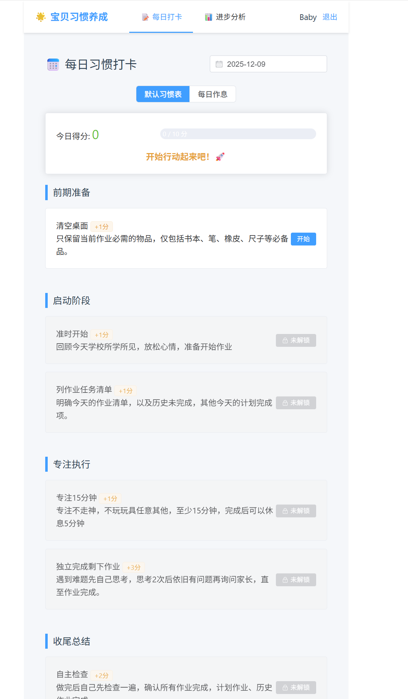
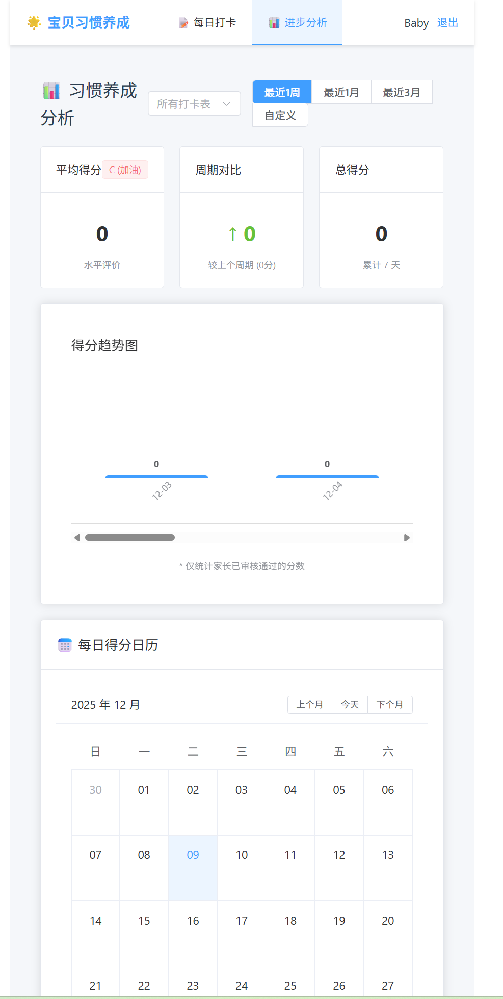
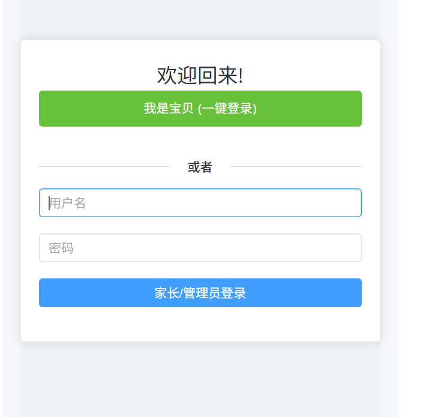
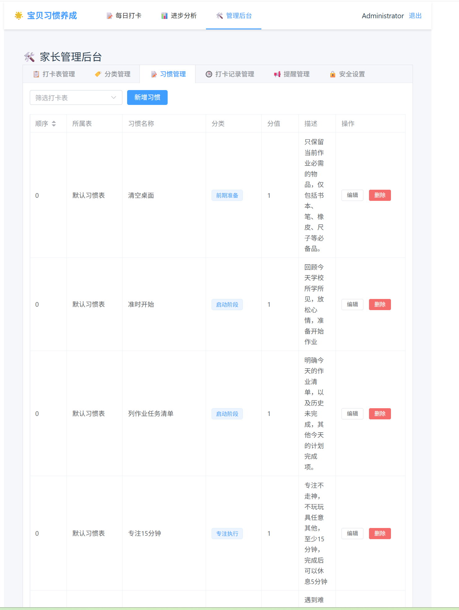
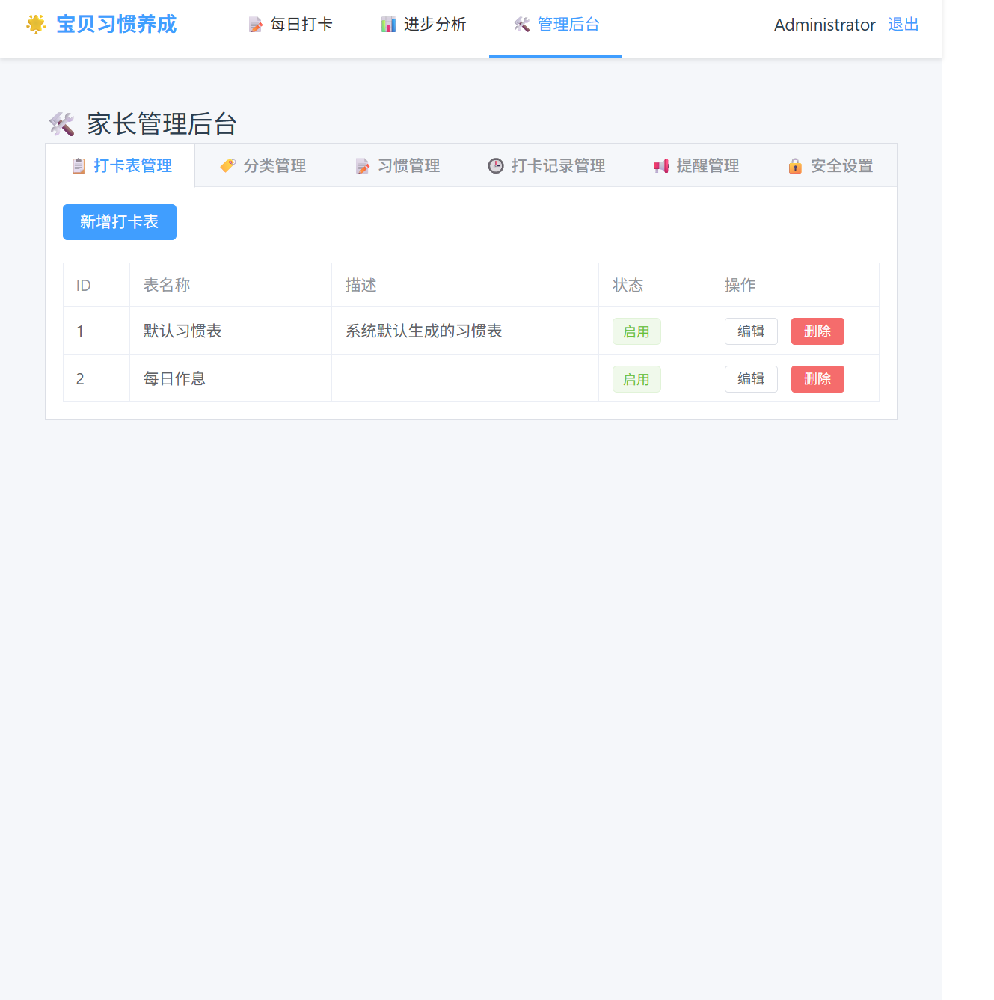

# BabyHabit
这是一套简易的用ai生成的程序，目的是方便宝宝养成好习惯（小学）。  他允许宝宝直接每天打卡（无需登录），家长登录后台（用账号密码）审核宝宝打卡信息。   通过家长后台审核打卡从而让记录宝宝每天积分。 进行奖励，从而触发宝宝的良好学习习惯。

## 支持：
- 宝宝直接登录，自己记录打卡，不可篡改，（等家长后台审核打分）
- 宝宝可以查看自己打分的同比数据，了解自己是否进步。
- 系统内置 每日作业 流程打卡评分表，方便宝宝打卡和家长 后台审核打分。
- 家长可以后台配置打卡内容、顺序、分值等。
- 家长可以后台配置、修改、增加 打卡项目和细节。

## 其他：
- 家长默认账号 admin/admin123
- 可以下载release 直接部署，后端使用python，前端直接html+ js。
- 后端推荐使用虚拟环境安装request库。
- 前端html 请修改js代码，替换 http://192.168.10.5:88 到你自己的后端地址即可。

## 部分截图：

